| Nama  | Oktovan Agung Shailendra|
|-------|-------------------------|
|NIM    |312010131                |
| Kelas | TI.20.A.1               |

---

## Langkah-langkah Praktikum
Persiapan membuat dokumen HTML dengan nama file **lab4_box.html** seperti berikut.

## Membuat Box Element
Kemudian tambahkan kode untuk membuat box element dengan tag div seperti berikut.

## CSS Float Property
Selanjutnya tambahkan deklarasi CSS pada head untuk membuat float element, seperti berikut, dan buka browser untuk melihat hasilnya
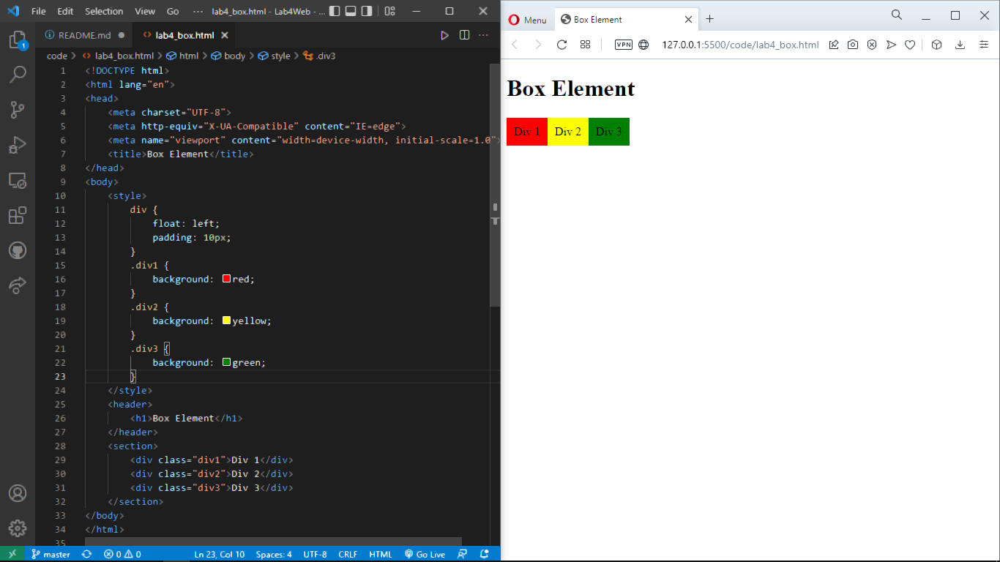

## Mengatur Clearfix Element
Clearfix digunakan untuk mengatur element setelah float element. Property clear digunakan untuk mengaturnya.
Tambahkan element div lainnya seteleah div3 seperti berikut.
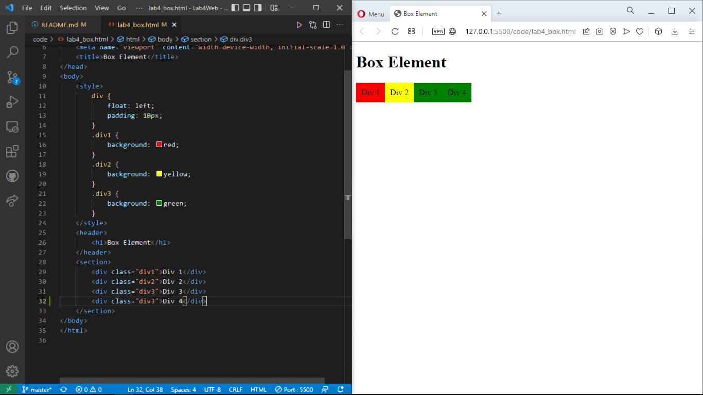
Kemudian atur property clear pada CSS seperti berikut, kemudian simpan dan lihat hasilnya pada web browser.

## Membuat Layout Sederhana
Kita akan membuat layout web sederhana seperti gambar berikut.

Buat **folder baru** dengan nama **lab4_layout**, kemudian buatlah file baru didalamnya dengan nama **home.html**, dan file css dengan nama **style.css**.
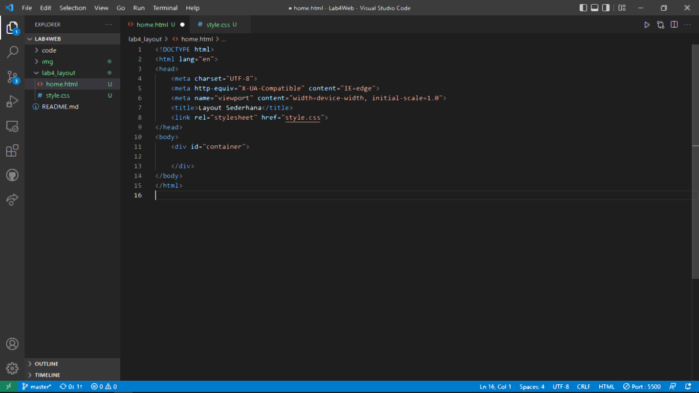

Kemudian buat kerangka layout dengan semantics element seperti berikut.

Kemudian tulis kode berikut dan liat hasilnya.
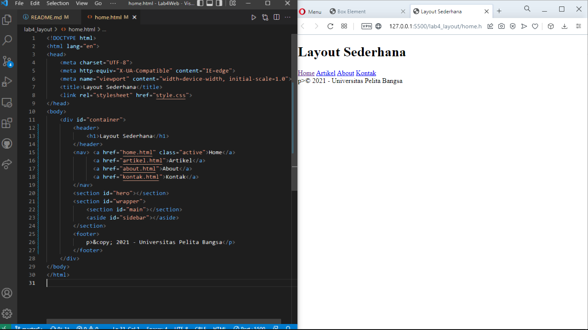

Kemudian tambah kode CSS untuk membuat layout, dan hasilnya akan sepertiberikut.
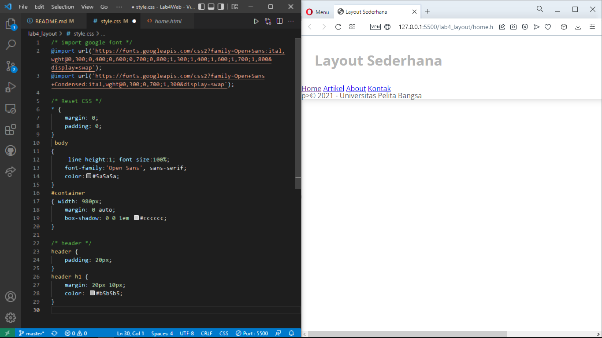

## Membuat Navigasi
Selanjutnya untuk mengatur navigasi dengan kode berikut, kemudian lihat hasilnya.
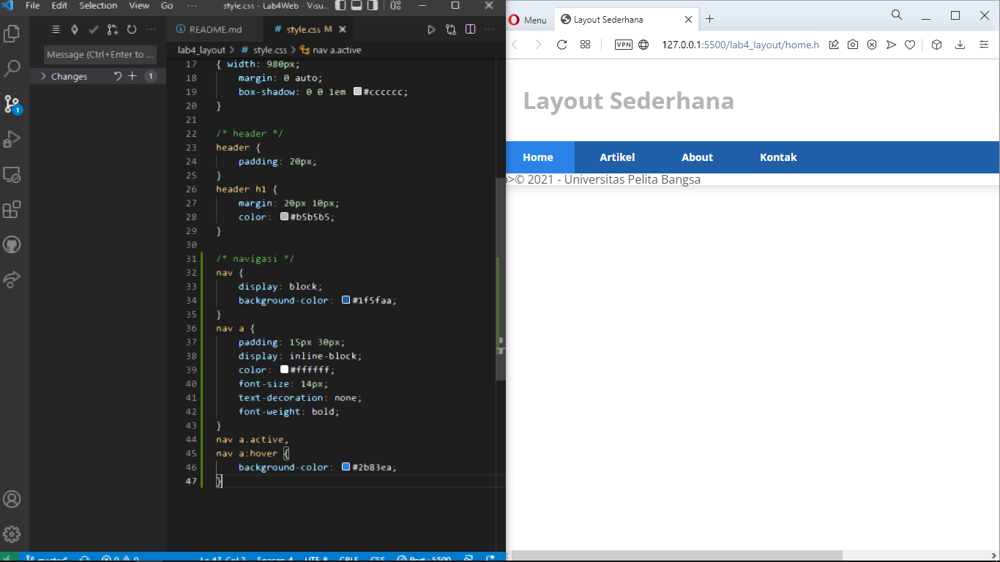

## Membuat Hero Panel
Selanjutnya membuat heropanel. Tambahkankode HTML dan CSS seperti berikut
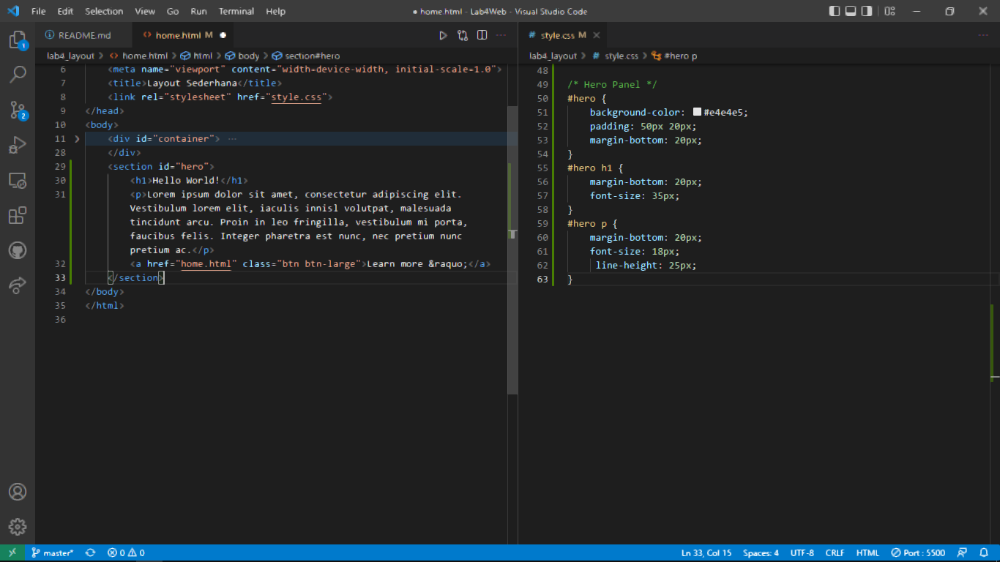

kemudian hasilnya akan seperti berikut:
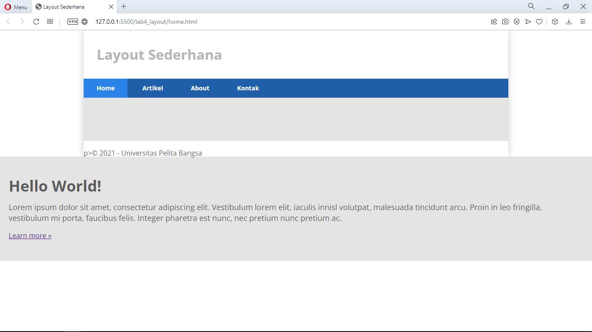

## Mengatur Layout Main & Sidebar
Selanjutnya mengatur main content dan sidebar, tambahkan CSS float.
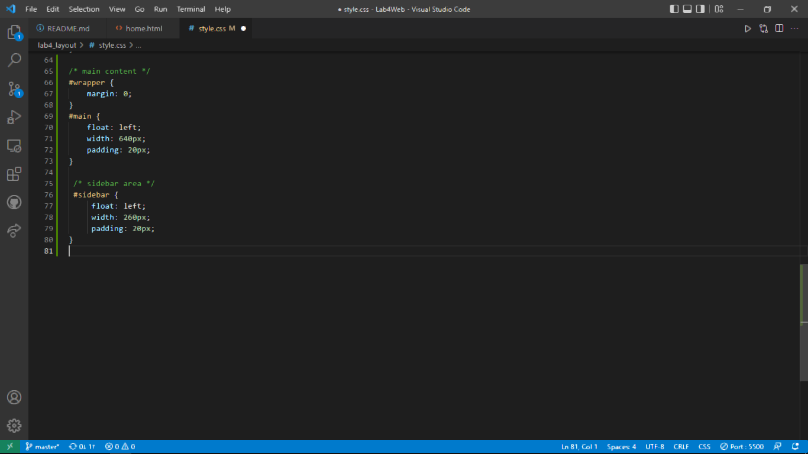

## Membuat Sidebar Widget
kemudian tambahkan elemen lain dalam sidebar, dan juga tambahkan CSS
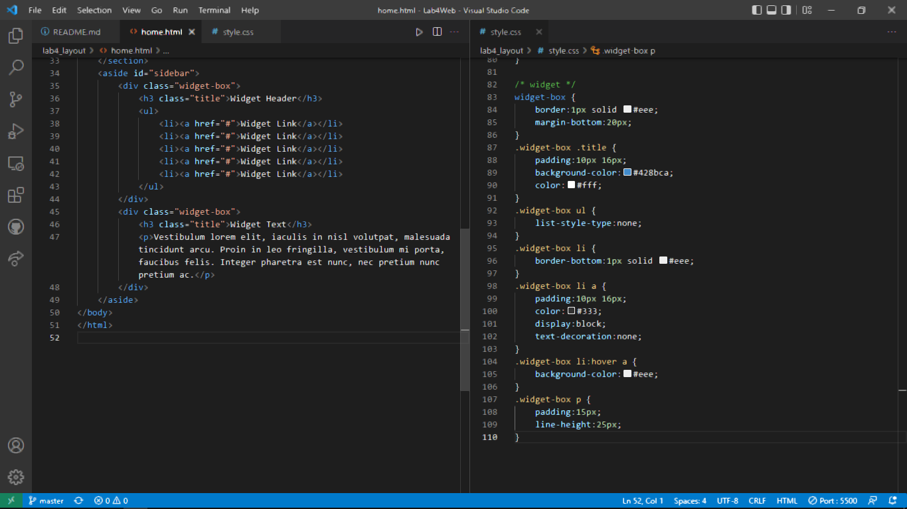

Maka hasilnya akan seperti berikut:
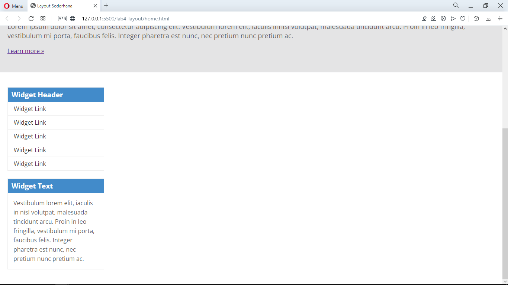

## Mengatur Footer
selanjutnya mengatur footer dengan menambahkan CSS untuk footer.
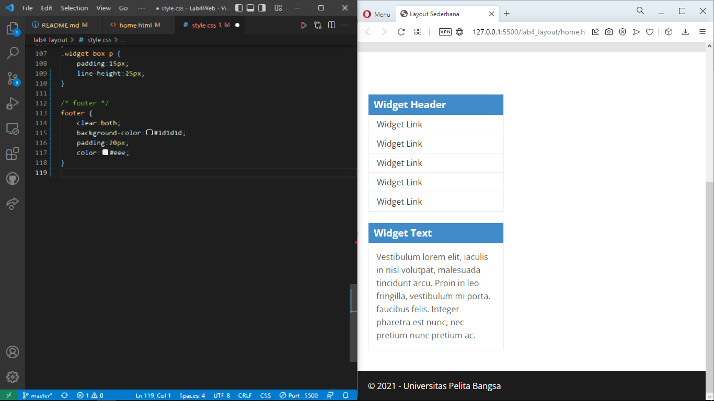

## Menambahkan Elemen Lainnya Pada Main Content
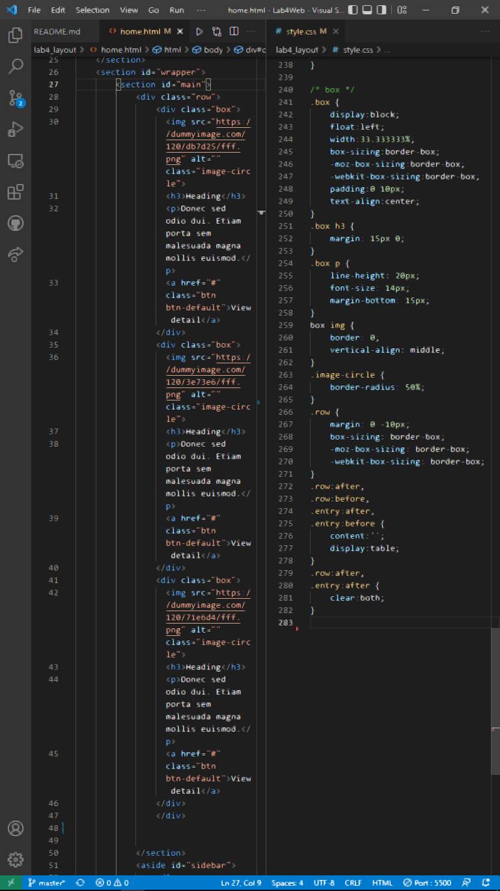

Maka hasilnya akan sepertiberikut:
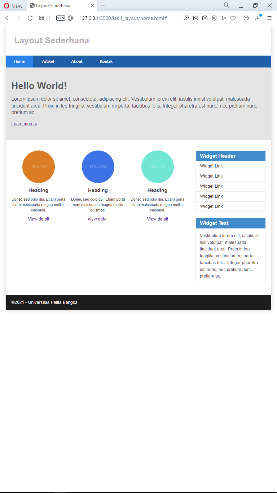

## Menambahkan Content Artikel
Selanjutnya membuat content artikel. Tambahkan HTML berikut pada main content.