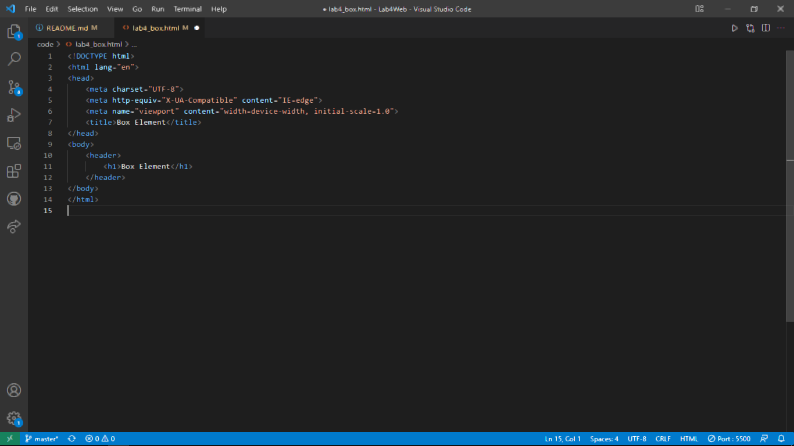
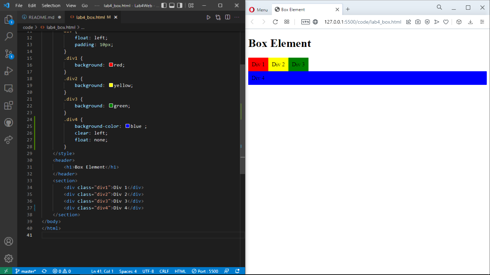
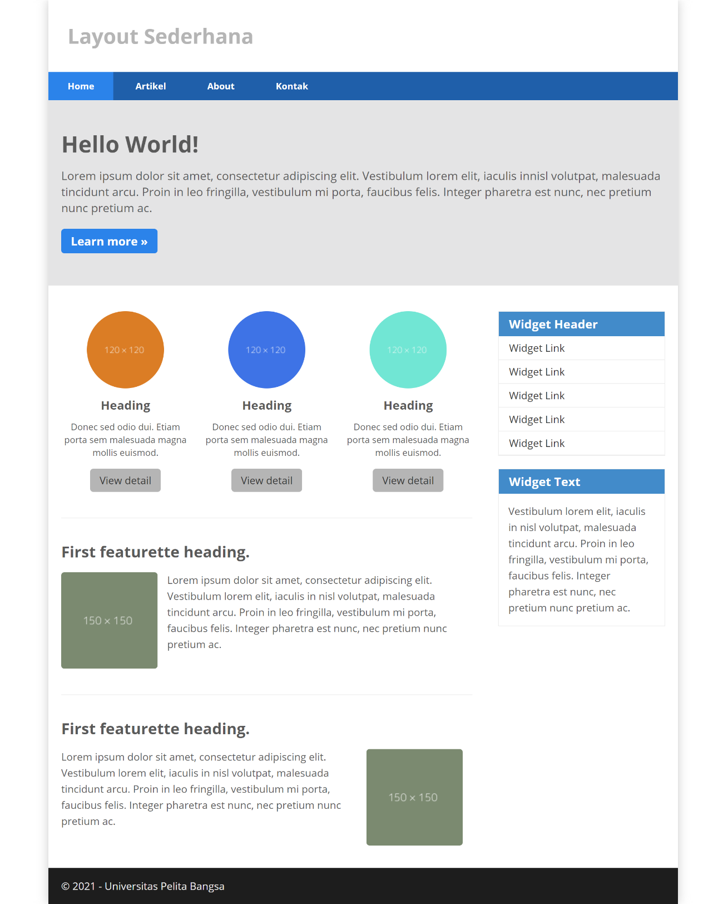

| Nama  | Oktovan Agung Shailendra|
|-------|-------------------------|
|NIM    |312010131                |
| Kelas | TI.20.A.1               |

---

## Langkah-langkah Praktikum
Persiapan membuat dokumen HTML dengan nama file **lab4_box.html** seperti berikut.

## Membuat Box Element
Kemudian tambahkan kode untuk membuat box element dengan tag div seperti berikut.

## CSS Float Property
Selanjutnya tambahkan deklarasi CSS pada head untuk membuat float element, seperti berikut, dan buka browser untuk melihat hasilnya

## Mengatur Clearfix Element
Clearfix digunakan untuk mengatur element setelah float element. Property clear digunakan untuk mengaturnya.
Tambahkan element div lainnya seteleah div3 seperti berikut.

Kemudian atur property clear pada CSS seperti berikut, kemudian simpan dan lihat hasilnya pada web browser.

## Membuat Layout Sederhana
Kita akan membuat layout web sederhana seperti gambar berikut.

Buat **folder baru** dengan nama **lab4_layout**, kemudian buatlah file baru didalamnya dengan nama **home.html**, dan file css dengan nama **style.css**.

Kemudian buat kerangka layout dengan semantics element seperti berikut.

